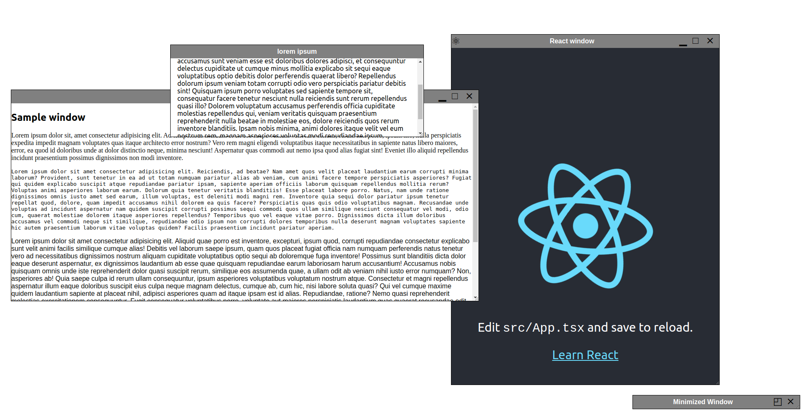

# Floating Window

TypeScript component for floating resizable windows in React.
<br />
<br />


---

<br />
<br />

## Installing

```bash
npm install floating-window-ui
```

OR

```bash
yarn add floating-window-ui
```

---

<br />
<br />

## Usage

```jsx
import React from "react";
import Window from "floating-window-ui";

const App = () => {
  return (
    <Window
      id="react-window"
      height={800}
      width={400}
      resizable={true}
      titleBar={{
        icon: "⚛",
        title: "React App Window",
        buttons: { minimize: true, maximize: true },
      }}
    >
      <div>...</div>
    </Window>
  );
};

export default App;
```
<br />
<br />

---

## Window component

A floating window which can be dragged, minimized, maximized and moved across.

### Props

| NAME | TYPE | DEFAULT | REQUIRED | DESCRIPTION |
|------|------|---------|----------|-------------|
|**id**|string| |&check;|HTML id attribute|
|**height**|number||&check;|Height of window including Title Bar|
|**width**|number||&check;|Width of window including|
|**top**|number|0|&cross;|Top position of window with repect to parent element in px|
|**left**|number|0|&cross;|Left position of window with repect to parent element in px|
|**resizable**|boolean|false|&cross;|Make window resizable of not|
|**titleBar**|object| |&cross;|Refer [Title Bar props](./README.md#title-bar-properties)|

### Title Bar properties

Title bar is a prop passed as an object to the Window Component for configuring title bar.

| NAME | TYPE | DEFAULT | REQUIRED | DESCRIPTION |
|------|------|---------|----------|-------------|
|**icon**|string\|HTMLImageElement|" "|&cross;|Icon to be displayed on top left of window|
|**title**|string|"Untitled window"|&cross;|Window title displayed on center of title bar|
|**buttons**|object| |&cross;|Refer [Title Bar Button props](./README.md#title-bar-buttons-properties)

### Title Bar Buttons properties

Buttons properies set whether to display certian buttons or not.
If any property for *titleBar* is set in the window component, value for all *buttons* defaults to false.

| NAME | TYPE | DEFAULT | REQUIRED | DESCRIPTION |
|------|------|---------|----------|-------------|
|**minimize**|boolean|true|&cross;|Displaying minimize button|
|**maximize**|boolean|true|&cross;|Displaying maximize button|
|**close**|boolean|true|&cross;|Display close button. (Does nothing on click)|

<br />
<br />

---

## Contributing

For contributing open a Pull Request with any changes/suggestions. Any kind of contribution will be much appreciated.

## Known Issues

Due to a bug in Firefox, the window does not moves with the mouse while dragging but will move to final position on dropping.

Refer [Set screen coordinates during HTML5 drag event](https://bugzilla.mozilla.org/show_bug.cgi?id=505521#c80)

Also see [Dragging window on Firefox](https://github.com/HARDY8118/floating-window-ui/issues/1)
